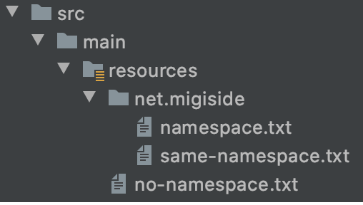

sbt-safe-resource
=================
*typesafe your resource*

sbt-safe-resource generate scala source that can access resource file safely.

Usage
-----
Add the plugin to `project/plugins.sbt`:

```scala
addSbtPlugin("net.migiside" % "sbt-safe-resource" % "x.y.z")
```

The sbt plugin automatically generate source code by default when compile and test. You can generate source code manually by running `safeResource`.

If you have a directory structure that looks like the following image.



You can access resources like this.

```scala
object Sample {
    def main(args: Array[String]): Unit = {
        net.migiside.`namespace.txt`.getResourceAsStream()
        net.migiside.`same-namespace.txt`.getResourceAsStream()
        `no-namespace.txt`.getResourceAsStream()
    }
}
```

License
-------
Apache License, Version 2.0
